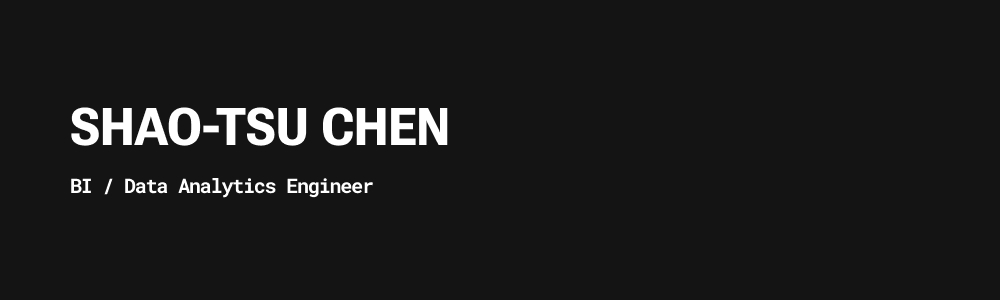

# Hi there, I'm Shao-Tsu 👋👨🏻‍💻

I’m a **BI / Data Analytics Engineer**. 

Some technology I enjoy working with including Python, dbt (Data build tool), Google Cloud Platform (GCP), Snowflake and Apache Airflow. *(of course, so much more!)*

*Fun fact: I’m self-taught and made the leap from operations to now BI / Data Engineering, so I get to understand how tech and business teams think easier. It’s like being bilingual, but for data!*

 

 

 

 

## Projects for Data Analytics Engineering

### [End-to-End ETL Data Pipeline - Crypto Market](https://github.com/shaotsuc/coincap-etl-data-pipeline)

I built a Python + PostgreSQL + dbt + Airflow pipeline to fetch, clean, and store live crypto market data—then visualized it in Metabase.

#### 💡 *Why?* 
> To explore data engineering hands-on using open-source tools!

 

### [Data Modeling - Verification Summary](https://github.com/shaotsuc/dbt-data-model-verification-summary)

I created dimensional models in dbt + PostgreSQL to turn raw data into an analysis-ready (or visualization-ready) dataset.

#### 🎯 *Goal?*

> To practice real-world dimensional modeling and make sure data is reliable and easy to use for dashboards or deeper analytics!

 

### [BI End-to-End Development - Sales Analysis](https://github.com/shaotsuc/bi-end-to-end-development-sales-analysis)

I transformed raw data with dbt, loaded it into BigQuery, and built Power BI dashboards to track sales performance.

#### ✅ *Outcome?* 

> To dive further BI end-to-end development for business. Clean data + clear visuals = faster business decisions!

 

### [Great Expectation framework - Casino Games dataset](https://github.com/shaotsuc/casino-games-dataset-great-expectations)
This project explores the fundamentals of data quality validation using the Great Expectations framework.

#### ✅ *Outcome?* 
> Understood how this framework can be integrated into a production-level data pipeline.

 

## Find me around the web 🌍:
- [Tableau Public](https://public.tableau.com/app/profile/shaotsuchen) 📊
- [Linkedin](https://www.linkedin.com/in/shaotsuchen/) 💼
- [DataCamp](https://www.datacamp.com/portfolio/shaotsuc) 👨🏻‍💻

